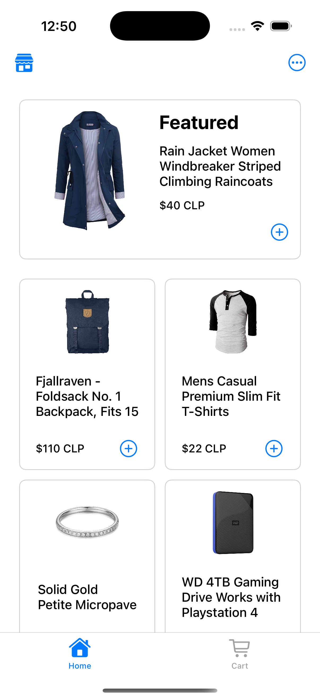
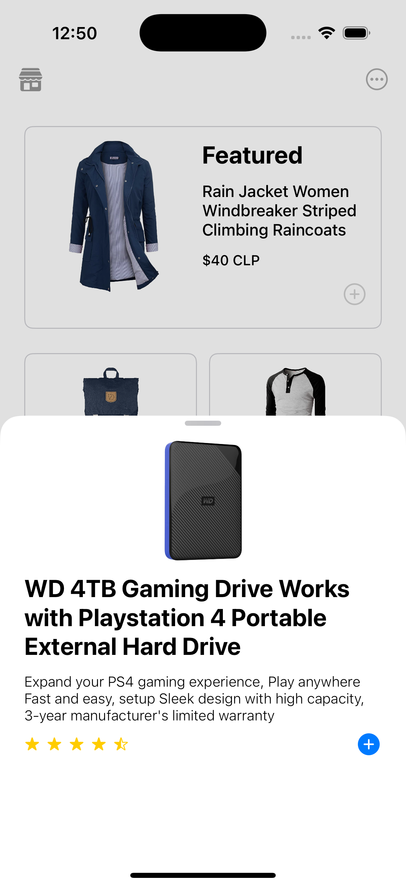
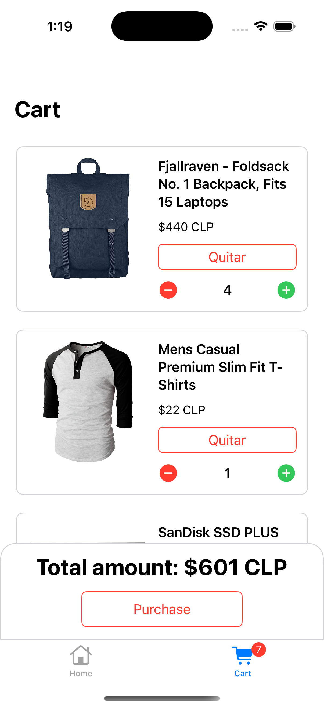
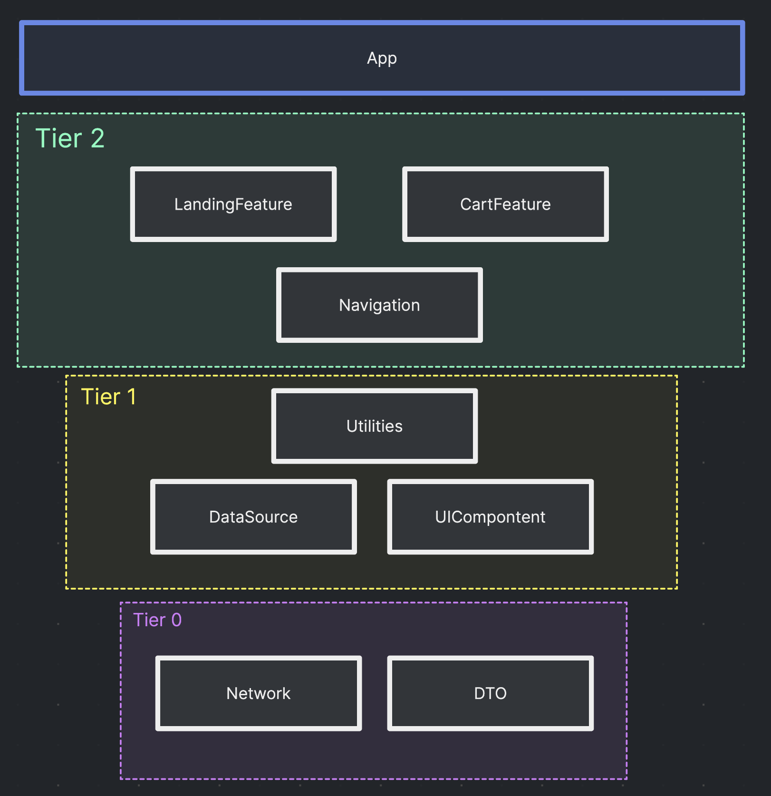

# Walmart Challenge iOS

## Description
This assessment evaluates capabilities for the Software Engineer position at Walmart. The challenge requires developing a Minimum Viable Product (MVP) for a small e-commerce platform that must fulfill the following core requirements:
- View products
- Browse categories
- Access product details and ratings
- Add products to shopping cart
- Remove products from shopping cart
- View total payment amount

This exercise aims to evaluate my coding skills by building a basic e-commerce app with essential shopping features.

Let people know what your project can do specifically. Provide context and add a link to any reference visitors might be unfamiliar with. A list of Features or a Background subsection can also be added here. If there are alternatives to your project, this is a good place to list differentiating factors.

## Vision
The vision for this development aims to project: Sufficient functionality to serve as an MVP, but with the appropriate foundations to scale if necessary.
Here is a list of design decisions for this system:
- Clean architecture (separation of concerns, enabling flexibility and quick iteration based on business needs).
- MVVM-C architecture (ViewModels remain unaffected when migrating to SwiftUI).
- Protocol-oriented programming to favor composition over inheritance.
- Implementation of multiple design patterns (Coordinator, DataSource, Repository, Factory, Observer, Adapter, Dependency Injection, and Composition Root) to support project modularization.
- Reusable UI components, including extensions to prevent code duplication for behavioral logic.
- Some A11y implementations.
- No third party dependencies for core functionality
- Swift 6 language mode supported.
- Complete Strict Concurrency Checking supported

## Areas for Improvement
To be honest, I had time constraints to complete this development, and the UI layer shows more polish in some details than others.
If time had not been an issue, these are the things I would have implemented:
- Pagination for LandingOverview view.
- Snackbar kind of UI component for managing cart notifications.
- Snapshot testing for the views.
- Table/Collection DataSource & Delegate unit tests.
- A better implementation for image fetching & caching, using Kingfisher.
- ScrollView for sheets product description.
- Constants file per feature for texts, etc.
- An AppCoordinator as starting point for the composition root instead of TabBarCoordinator.
- Layout warnings & better file management for UI.

## Assumptions
- BFF pattern for error and response handling (the app simulates a HumanizedError object on some requests).
- The App supports English only.
- No need to use the service for product details, considering all needed data from that service is already fetched from the general or category products service.
- No UI buttons for the top right of the screen, instead the app supports native behavior from some UI components (some more polished than others).
- Persistence is managed with just an UserDefaults abtraction.

## Installation
The project only needs to be cloned and run (on simulator or device). Currently, it does not contain any third-party dependencies that need to be downloaded. Please check the badges above to see a better summary of the minimum requirements.

## Screenshots

  
  
  
  
  

## Authors and acknowledgment
Thank you to the Walmart team for trusting in my abilities, and I hope we can work together.
